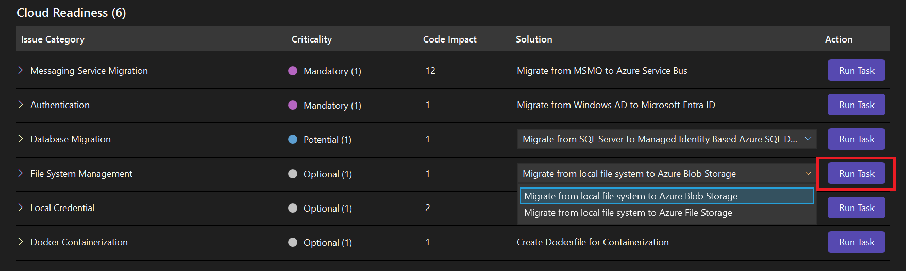

# ContosoUniversity - Azure Migration Demo for GitHub Copilot

A comprehensive demonstration project showcasing how to use **GitHub Copilot app modernization for .NET** to migrate a .NET Framework application from local file storage to Azure Blob Storage.

## 📋 Prerequisites

Before you begin, ensure you have:

- **[Visual Studio 2022](https://visualstudio.microsoft.com/)**. Ensure the installed version is equal or higher than 17.14.16. If not, install the preview version **[Microsoft Visual Studio Enterprise 2022 - Int Preview](https://aka.ms/vs/17/intpreview/vs_enterprise.exe)**. Ensure the following workloads are selected during installation
    - ASP.NET and web development
    - .NET desktop development
- **[Git](https://git-scm.com/)** for version control
- **GitHub account** with Copilot access

## ⚙️ VS Configuration

- Set the environment variable `COPILOT_INTERNALUSER=true` in your system to enable the GitHub Copilot internal use features.
- Set GitHub Copilot settings in Visual Studio by clicking on the GitHub Copilot icon in the toolbar and selecting **Settings**. Choose **Options**, then in the opened settings window, select **Feature flags(internal)** and **Chat UX**, at the bottom of the window, you will the following two options, modify their values as listed.
  - `MaxFunctionCallIterations` = `100`
  - `TokenLowWarningThresholdPercentage` = `200`
- restart Visual Studio when update all the configuration options.

## 🚀 Getting Started

### Step 1: Install GitHub Copilot for App Modernization Extension

1. Open **Visual Studio 2022**
2. Navigate to **Extensions** → **Manage Extensions**
3. Search for **"GitHub Copilot App Modernization for .NET"**
4. Click **Download** and restart Visual Studio when prompted
5. Sign in with your GitHub account that has Copilot access

### Step 2: Clone and Open the Project

```sh
git clone https://github.com/your-repo/ContosoUniversity-NoAuth-EFCore.git
cd ContosoUniversity-NoAuth-EFCore
```

Open the solution file `ContosoUniversity.sln` in Visual Studio 2022.

## 🔄 Demonstration: Migrating to Azure Blob Storage

### Step 1: Run Assessment

1. In Visual Studio, open **GitHub Copilot Chat**
2. Type: 
	```
	@Modernize Migrate to Azure
	```
3. The extension will analyze your code and identify modernization opportunities
4. Review the assessment report showing local file system usage

### Step 2: Start Migration

1. In the assessment report, click **Run Task** button for the issue of **File System Management**:

   

2. The extension will:
   - Create a migration plan in `.appmod/.migration/plan.md`
   - Set up progress tracking in `.appmod/.migration/progress.md`

3. After the plan is created, the agent will stop to ask you to review the plan. Type "Continue" to proceed with the migration.

4. During migration, the agent will call various tools and commands to execute version control and code modification, please "Allow" when the tool calls are asked.

4. After the code is migrated, the agent will build and validate this project, and fix if any errors are detected.

### Step : Review Migration Results

The extension provides comprehensive tracking:
- ✅ **Detailed progress tracking** with checkboxes for each task
- 🔄 **Git commits** for each major step with descriptive messages
- 🏗️ **Build verification** to ensure compilation succeeds
- 🔒 **Security validation** to check for vulnerabilities

