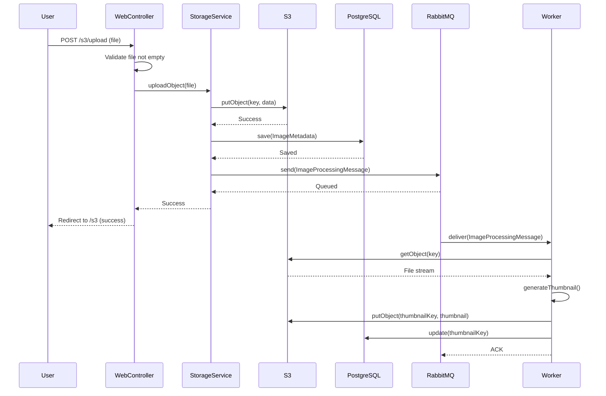
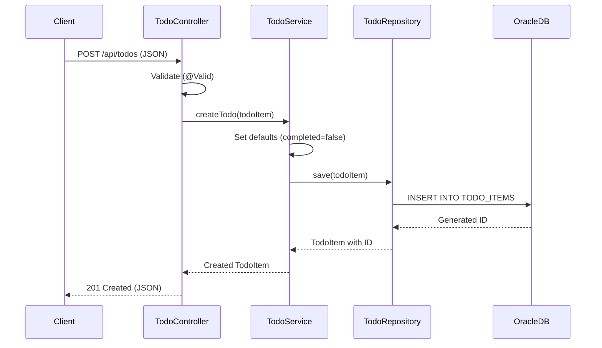
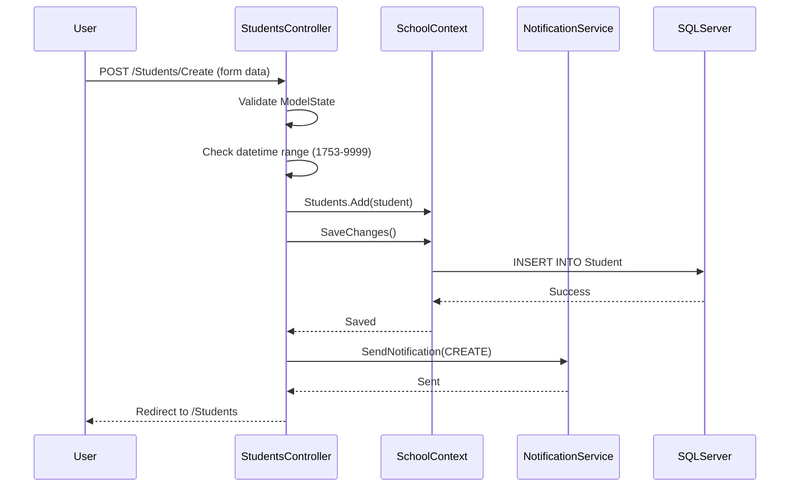
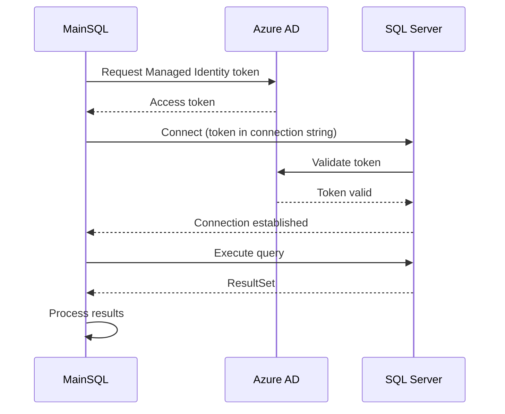

# Sequence Diagrams - Interaction Flows

**Analysis Date:** December 2024  
**Format:** Mermaid text-based diagrams

---

## asset-manager: File Upload Flow

---

## todo-web-api: Create Todo Flow

---

## ContosoUniversity: Student Creation Flow

---

## mi-sql-public-demo: Managed Identity Authentication

---

**Related Documentation:**
- [Workflows](../../behavior/workflows.md)
- [Activity Diagrams](activity-diagrams.md)
- [Business Logic](../../behavior/business-logic.md)
