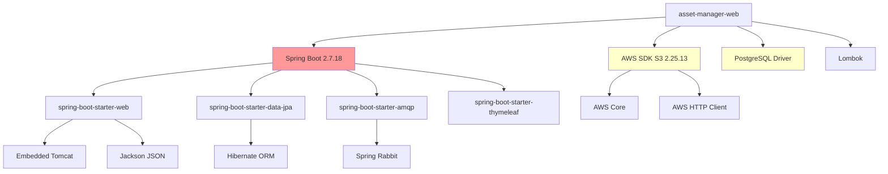
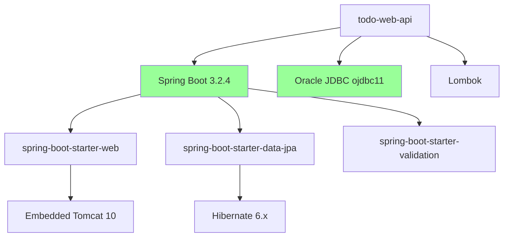
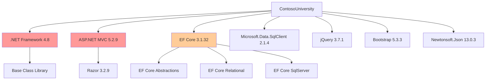
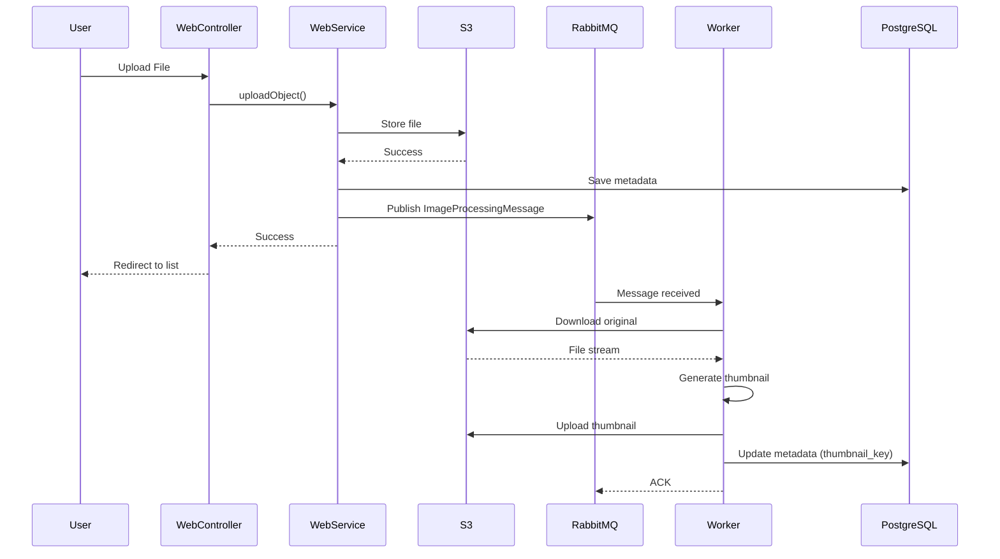

# Dependency Graphs - Visual Representations

**Analysis Date:** December 2024  
**Format:** Text-based diagrams (Mermaid + ASCII art)  
**Purpose:** Visualize dependency relationships for understanding and migration planning

---

## Table of Contents
- [External Dependencies by Project](#external-dependencies-by-project)
- [Internal Component Dependencies](#internal-component-dependencies)
- [Multi-Module Dependencies](#multi-module-dependencies)
- [Data Flow Dependencies](#data-flow-dependencies)
- [Migration Dependency Chains](#migration-dependency-chains)

---

## External Dependencies by Project

### asset-manager Web Module



**Legend:**
- 🔴 Red: CRITICAL priority update
- 🟡 Yellow: MEDIUM priority update
- 🟢 Green: LOW priority / good status

---

### todo-web-api



---

### ContosoUniversity



---

## Internal Component Dependencies

### asset-manager Multi-Module Internal Structure

```
┌────────────────────────────────────────────────────┐
│          assets-manager-parent (POM)               │
│                                                    │
│  Provides: Spring Boot 2.7.18                     │
│           Java 8                                   │
│           AWS SDK 2.25.13                         │
└──────────────┬──────────────────┬─────────────────┘
               │                  │
               │                  │
    ┌──────────▼─────────┐  ┌────▼──────────────┐
    │  Web Module        │  │ Worker Module     │
    │                    │  │                   │
    │  ┌──────────────┐  │  │  ┌──────────────┐│
    │  │Controllers   │  │  │  │@RabbitListener││
    │  │   │          │  │  │  │   │          ││
    │  │   ▼          │  │  │  │   ▼          ││
    │  │Services      │  │  │  │FileProcessors││
    │  │   │          │  │  │  │   │          ││
    │  │   ├────────┐ │  │  │  │   ├────────┐ ││
    │  │   ▼        │ │  │  │  │   ▼        │ ││
    │  │Repositories│ │  │  │  │Repositories│ ││
    │  └────┬───────┴─┘  │  │  └────┬───────┴─┘│
    │       │            │  │       │          │
    │       │            │  │       │          │
    │  ┌────▼─────────┐  │  │  ┌────▼─────────┐│
    │  │ S3Client     │  │  │  │ S3Client     ││
    │  │ RabbitTemplate│ │  │  │              ││
    │  └──────────────┘  │  │  └──────────────┘│
    └────────┬───────────┘  └────┬─────────────┘
             │                   │
             │                   │
    ┌────────▼───────────────────▼─────────────┐
    │         External Dependencies            │
    │                                          │
    │  ┌──────────┐  ┌──────────┐  ┌────────┐ │
    │  │PostgreSQL│  │RabbitMQ  │  │AWS S3  │ │
    │  │(Metadata)│  │(Messages)│  │(Files) │ │
    │  └──────────┘  └──────────┘  └────────┘ │
    └──────────────────────────────────────────┘
```

**Key Dependencies:**
- **Parent → Modules:** Version inheritance (compile-time)
- **Web → RabbitMQ:** Message publishing (runtime)
- **Worker → RabbitMQ:** Message consumption (runtime)
- **Both → PostgreSQL:** Shared database (runtime)
- **Both → S3:** File storage (runtime)

---

### ContosoUniversity Layered Architecture

```
┌────────────────────────────────────────────┐
│            Presentation Layer              │
│                                            │
│  ┌──────────────────────────────────────┐  │
│  │ Controllers                          │  │
│  │  - StudentsController                │  │
│  │  - CoursesController                 │  │
│  │  - InstructorsController             │  │
│  │  - DepartmentsController             │  │
│  └──────────┬───────────────────────────┘  │
└─────────────┼──────────────────────────────┘
              │
              │ Direct coupling (no abstraction)
              │
┌─────────────▼──────────────────────────────┐
│         Data Access Layer                  │
│                                            │
│  ┌──────────────────────────────────────┐  │
│  │ SchoolContext (DbContext)            │  │
│  │                                      │  │
│  │  DbSet<Student>                      │  │
│  │  DbSet<Course>                       │  │
│  │  DbSet<Instructor>                   │  │
│  │  DbSet<Department>                   │  │
│  │  DbSet<Enrollment>                   │  │
│  └──────────┬───────────────────────────┘  │
└─────────────┼──────────────────────────────┘
              │
              │ Entity Framework Core 3.1.32
              │
┌─────────────▼──────────────────────────────┐
│            Database Layer                  │
│                                            │
│  ┌──────────────────────────────────────┐  │
│  │ SQL Server Database                  │  │
│  │                                      │  │
│  │  Tables: Student, Course,            │  │
│  │          Instructor, Department,     │  │
│  │          Enrollment, etc.            │  │
│  └──────────────────────────────────────┘  │
└────────────────────────────────────────────┘
```

**Pattern:** No repository layer (controllers use DbContext directly)

---

## Multi-Module Dependencies

### asset-manager Module Interaction



**Dependency Types:**
- **Compile-time:** Parent POM versions
- **Runtime:** Database, message queue, S3 connections
- **Loose coupling:** Modules communicate via messages

---

## Data Flow Dependencies

### HTTP Request Flow (asset-manager Web)

```
┌─────────┐
│ Browser │
└────┬────┘
     │ HTTP GET /s3
     ▼
┌──────────────┐
│S3Controller  │
└────┬─────────┘
     │ listObjects()
     ▼
┌──────────────┐
│StorageService│ (Interface)
└────┬─────────┘
     │
     ├──────────────┬──────────────┐
     ▼              ▼              ▼
┌─────────────┐ ┌───────────┐ ┌──────────┐
│AwsS3Service │ │PostgreSQL │ │AWS S3    │
│             │ │(Metadata) │ │(Objects) │
└─────────────┘ └───────────┘ └──────────┘
```

---

### Message Queue Flow (asset-manager)

```
Web Module                Worker Module
─────────────────────────────────────────

┌─────────────┐           ┌──────────────┐
│uploadObject()│           │@RabbitListener│
└──────┬──────┘           └──────▲───────┘
       │                         │
       │ Publish                 │ Consume
       ▼                         │
   ┌────────────────────────────────┐
   │      RabbitMQ Queue           │
   │  (ImageProcessingMessage)     │
   └────────────────────────────────┘
       
Dependencies:
- spring-boot-starter-amqp (both modules)
- RabbitMQ server (external)
- Shared message format (ImageProcessingMessage)
```

---

## Migration Dependency Chains

### asset-manager Upgrade Path

```
Current State                Action Required              Target State
──────────────────────────────────────────────────────────────────────

┌──────────┐                                           ┌──────────┐
│ Java 8   │  ──────────┐                              │ Java 17  │
└──────────┘            │                              └──────────┘
                        │ Upgrade Java                       │
┌──────────┐            │ (enables Spring Boot 3)            │
│Spring    │  ──────────┘                                    │
│Boot 2.7  │                                                 │
└──────────┘            ┌───────────────────────────────────┘
                        │
                        │ Upgrade Spring Boot
                        │ (requires Java 17+)
                        │ (Jakarta EE namespace changes)
                        ▼
                   ┌──────────┐
                   │Spring    │
                   │Boot 3.x  │
                   └──────────┘
                        │
                        │ Update dependencies
                        │ (AWS SDK, PostgreSQL driver)
                        ▼
                   ┌──────────┐
                   │Updated   │
                   │Deps      │
                   └──────────┘
```

**Dependency Chain:**
1. Java 8 → Java 17 (MUST happen first)
2. Spring Boot 2.7 → 3.x (requires Java 17)
3. Update AWS SDK (may be required for compatibility)
4. Update PostgreSQL driver (ensure compatibility)

---

### ContosoUniversity Upgrade Path

```
Current State                Action Required              Target State
──────────────────────────────────────────────────────────────────────

┌──────────┐                                           ┌──────────┐
│.NET      │            ┌──────────────────────────────│.NET 6/8  │
│Framework │            │                              └──────────┘
│4.8       │            │ Platform migration                │
└──────────┘            │ (major undertaking)               │
                        │                                   │
┌──────────┐            │                                   │
│ASP.NET   │  ──────────┘                                   │
│MVC 5     │                                                │
└──────────┘            ┌───────────────────────────────────┘
                        │
┌──────────┐            │ Framework migration
│EF Core   │  ──────────┘ (ASP.NET MVC → ASP.NET Core)
│3.1.32    │                                    │
└──────────┘            ┌──────────────────────┘
                        │
                        │ ORM upgrade
                        │ (EF Core 3.1 → EF Core 7/8)
                        ▼
                   ┌──────────┐
                   │ASP.NET   │
                   │Core MVC  │
                   └──────────┘
                        │
                        ▼
                   ┌──────────┐
                   │EF Core   │
                   │7/8       │
                   └──────────┘
```

**Dependency Chain:**
1. .NET Framework 4.8 → .NET 6/8 (MUST happen first)
2. ASP.NET MVC 5 → ASP.NET Core MVC (requires .NET 6+)
3. EF Core 3.1 → EF Core 7/8 (requires .NET 6+)
4. Update all NuGet packages (compatibility)

---

## Dependency Complexity Metrics

### Project Complexity Scores

| Project | Direct Deps | Transitive Deps | Complexity Score | Risk Level |
|---------|-------------|-----------------|------------------|------------|
| asset-manager (web) | 11 | ~80 | HIGH | CRITICAL |
| asset-manager (worker) | 8 | ~60 | HIGH | CRITICAL |
| todo-web-api | 7 | ~70 | MEDIUM | LOW |
| mi-sql-public-demo | 3 | ~15 | LOW | MEDIUM |
| rabbitmq-sender | 2 | ~40 | MEDIUM | LOW |
| jakarta-ee | ~10 (JARs) | Unknown | HIGH | HIGH |
| ContosoUniversity | 47 | Unknown | HIGH | CRITICAL |
| Malshinon | ~5 | Unknown | LOW | MEDIUM |

**Complexity Factors:**
- Number of direct dependencies
- Number of transitive dependencies
- Framework version currency
- Platform support status
- Multi-module structure

---

## Circular Dependency Analysis

### Detected Circular Dependencies

**None Found** - All projects have acyclic dependency graphs

**Good Practice:** Maven and .NET enforce acyclic dependencies at build time

---

## Dependency Update Impact Analysis

### Low Risk Updates (Can be done independently)

```
┌─────────────────┐
│ PostgreSQL      │  ← Update driver version
│ Driver          │     (backward compatible)
└─────────────────┘

┌─────────────────┐
│ Lombok          │  ← Update version
│                 │     (compile-time only)
└─────────────────┘

┌─────────────────┐
│ mssql-jdbc      │  ← Update driver version
│                 │     (backward compatible)
└─────────────────┘
```

---

### High Risk Updates (Cascade effects)

```
┌─────────────────┐
│ Spring Boot     │  ← Upgrading affects:
│ 2.7 → 3.x       │     - All Spring modules
└────────┬────────┘     - Servlet API (Jakarta EE)
         │              - Hibernate version
         │              - Jackson version
         │              - Many transitive deps
         ▼
    ┌────────────────────┐
    │ ~50 dependencies   │
    │ require updates    │
    └────────────────────┘
```

---

## Recommendations

### Dependency Management Best Practices

1. **Pin All Versions:** Avoid "latest" - use specific versions
2. **Dependency Scanning:** Regular vulnerability scans
3. **Update Strategy:** Regular, incremental updates (not big bang)
4. **Testing:** Comprehensive testing after updates
5. **Documentation:** Document all dependency changes

### Migration Priority

**Priority 1 (Immediate):**
- asset-manager: Java 8 → 17
- asset-manager: Spring Boot 2.7 → 3.x

**Priority 2 (3-6 months):**
- ContosoUniversity: .NET Framework → .NET 6/8
- jakarta-ee: Ant → Maven

**Priority 3 (6-12 months):**
- Malshinon: .NET Framework → .NET 6/8
- All projects: Implement automated dependency scanning

---

**Related Documentation:**
- [Dependencies Overview](../../architecture/dependencies.md)
- [Dependency Analysis](../../analysis/dependency-analysis.md)
- [Technical Debt Report](../../technical-debt-report.md)
- [Migration Order](../../migration/component-order.md)
