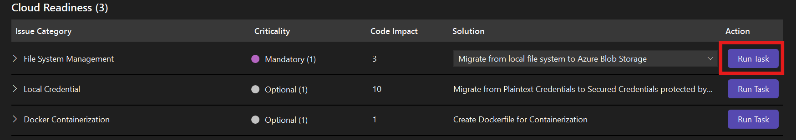

# Malshinon - Azure Migration Demo for GitHub Copilot

A comprehensive demonstration project showcasing how to use **GitHub Copilot app modernization for .NET** to migrate a .NET Framework application from local file storage to Azure Blob Storage.

## 📋 Prerequisites

Before you begin, ensure you have:

- **[Visual Studio 2022](https://visualstudio.microsoft.com/)**. Ensure the installed version is equal or higher than 17.14.16. If not, install the preview version **[Microsoft Visual Studio Enterprise 2022 - Int Preview](https://aka.ms/vs/17/intpreview/vs_enterprise.exe)**. Ensure the following workloads are selected during installation
    - ASP.NET and web development
    - .NET desktop development
- **[Git](https://git-scm.com/)** for version control
- **GitHub account** with Copilot access

## ⚙️ VS Configuration

1. Set the environment variable `COPILOT_INTERNALUSER=true` in your system to enable the GitHub Copilot internal use features.
1. Set the following GitHub Copilot settings in "Tools" menu --> "Options...". Search the setting from the top left search box, and update the value accordingly.
    - `TokenLowWarningThresholdPercentage`: 200 (This is to mitigate a issue where the token limit is too strict and the session cannot proceed after a few steps)
    - `MaxFunctionCallIterations`: 100
1. Install the App Modernization extension
    1. Navigate to **Extensions** → **Manage Extensions**
    1. Search for **"GitHub Copilot App Modernization for .NET"**
    1. Click **Download**
1. Restart Visual Studio
1. Click the "GitHub Copilot" button on the top right of VS, and click "Open Chat Window". Sign in with your GitHub account.

## 🚀 Getting Started


### Step 1: Clone and Open the Project

```sh
git clone https://github.com/Azure-Samples/java-migration-copilot-samples.git
cd java-migration-copilot-samples\Malshinon
```

Open the solution file `Malshinon.sln` in Visual Studio 2022.

## 🔄 Demonstration: Migrating to Azure Blob Storage

### Step 1: Run Assessment

1. In Visual Studio, open **GitHub Copilot Chat**
2. Type: 
	```
	@Modernize Migrate to Azure
	```
3. The extension will analyze your code and identify modernization opportunities
4. Review the assessment report showing local file system usage

### Step 2: Start Migration

1. In the assessment report, click **Run Task** button for the issue of **File System Management**:

   

2. The extension will:
   - Create a migration plan in `.appmod/.migration/plan.md`
   - Set up progress tracking in `.appmod/.migration/progress.md`

3. After the plan is created, the agent will stop to ask you to review the plan. Type "Continue" to proceed with the migration.

4. During migration, the agent will call various tools and commands to execute version control and code modification, please "Allow" when the tool calls are asked.

4. After the code is migrated, the agent will build and validate this project, and fix if any errors are detected.

Some tips during the migration:

- After updating project related settings, it will reload the project. This is likely to bring the "Solution Explorer" view to the top, and you need to click the "GitHub Copilot Chat" view tab to bring it back and check the latest conversations.
- If the session stop in the middle of the whole process. Try sending "Continue" in the chat box to resume.
### Step 3: Review Migration Results

The extension provides comprehensive tracking:
- ✅ **Detailed progress tracking** with checkboxes for each task
- 🔄 **Git commits** for each major step with descriptive messages
- 🏗️ **Build verification** to ensure compilation succeeds
- 🔒 **Security validation** to check for vulnerabilities
