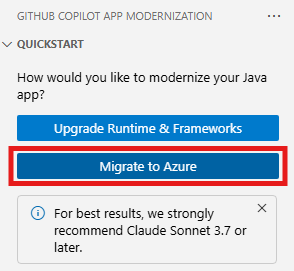

# Workshop: migrate this project to Azure

- [Workshop: migrate this project to Azure](#workshop-migrate-this-project-to-azure)
  - [About this Project](#about-this-project)
    - [Original Infrastructure](#original-infrastructure)
    - [Original Architecture](#original-architecture)
    - [Migrated Infrastructure](#migrated-infrastructure)
    - [Migrated Architecture](#migrated-architecture)
  - [Prerequisites](#prerequisites)
  - [Install GitHub Copilot app modernization](#install-github-copilot-app-modernization)
  - [Migrate the Sample Java Application](#migrate-the-sample-java-application)
    - [Assess Your Java Application](#assess-your-java-application)
    - [Migrate to Azure Database for PostgreSQL Flexible Server using Predefined Tasks](#migrate-to-azure-database-for-postgresql-flexible-server-using-predefined-tasks)
    - [Migrate to Azure Blob Storage and Azure Service Bus using Custom Tasks](#migrate-to-azure-blob-storage-and-azure-service-bus-using-custom-tasks)
  - [Deploy to Azure](#deploy-to-azure)
  - [Clean up](#clean-up)

GitHub Copilot app modernization, assists with app assessment, planning and code remediation. It automates repetitive tasks, boosting developer confidence and speeding up the Azure migration and ongoing optimization.

In this workshop, you learn how to use GitHub Copilot app modernization to assess and migrate a sample Java application `asset-manager` to Azure.

## About this Project

This application consists of two sub-modules, **Web** and **Worker**.  Both of them contain functions of using storage service and message queue. To demonstrate the migration process, this GitHub repository is mainly composed of 3 different branches:

- [`source`](https://github.com/Azure-Samples/java-migration-copilot-samples/tree/source/asset-manager) branch: The original project before being migrated to Azure service.
- [`main`](https://github.com/Azure-Samples/java-migration-copilot-samples/tree/main/asset-manager) branch: Only the `web` module is migrated to use Azure service. This branch will be used for the workshop.
- [`expected`](https://github.com/Azure-Samples/java-migration-copilot-samples/tree/expected/asset-manager) branch: The is the final migrated state, and both `web` and `worker` modules are migrated to Azure.

### Original Infrastructure

The project uses the following infrastructure, in [`source`](https://github.com/Azure-Samples/java-migration-copilot-samples/tree/source/asset-manager) branch:

* AWS S3 for image storage, using password-based authentication (access key/secret key)
* RabbitMQ for message queuing, using password-based authentication
* PostgreSQL database for metadata storage, using password-based authentication

### Original Architecture


Password-based authentication

### Migrated Infrastructure

After migration, the project will use the following Azure services, in [`expected`](https://github.com/Azure-Samples/java-migration-copilot-samples/tree/expected/asset-manager) branch:

* Azure Blob Storage for image storage, using managed identity authentication
* Azure Service Bus for message queuing, using managed identity authentication
* Azure Database for PostgreSQL for metadata storage, using managed identity authentication

### Migrated Architecture


Managed identity based authentication

## Prerequisites

To successfully complete this workshop, you need the following:

- [VSCode](https://code.visualstudio.com/): The latest version is recommended.
- [A Github account with Github Copilot enabled](https://github.com/features/copilot): All plans are supported, including the Free plan.
- [GitHub Copilot extension in VSCode](https://code.visualstudio.com/docs/copilot/overview): The latest version is recommended.
- [JDK 21](https://learn.microsoft.com/en-us/java/openjdk/download#openjdk-21): Required for the code remediation feature and running the initial application locally.
- [Maven 3.9.9](https://maven.apache.org/install.html): Required for the assessment and code remediation feature.

If you want to deploy the application to Azure, the following are required:
- [Azure subscription](https://azure.microsoft.com/free/): Required to deploy the migrated application to Azure.
- [Azure CLI](https://docs.microsoft.com/cli/azure/install-azure-cli): Required if you deploy the migrated application to Azure locally. The latest version is recommended.
- Fork the [GitHub repository](https://github.com/Azure-Samples/java-migration-copilot-samples) that contains the sample Java application. Please ensure to **uncheck** the default selection "Copy the `main` branch only". Clone it to your local machine. Open the `asset-manager` folder in VSCode and checkout the `main` branch.

## Install GitHub Copilot app modernization

In VSCode, open the Extensions view from Activity Bar, search `GitHub Copilot app modernization` extension in marketplace. Select the Install button on the extension. After installation completes, you should see a notification in the bottom-right corner of VSCode confirming success.

## Migrate the Sample Java Application

The following sections guide you through the process of migrating the sample Java application `asset-manager` to Azure using GitHub Copilot app modernization.

### Assess Your Java Application

The first step is to assess the sample Java application `asset-manager`. The assessment provides insights into the application's readiness for migration to Azure.

1. Open the VS code with all the prerequisites installed on the asset manager by changing the directory to the `asset-manager` directory and running `code .` in that directory.
1. Open the extension `GitHub Copilot app modernization`.
1. In the **QUICKSTART** view, click **Migrate to Azure** button to trigger the Modernization Assessor.

   

1. Wait for the assessment to be completed and the report to be generated.
1. Review the **Assessment Report**. Select the **Issues** tab to view the proposed solutions for the issues identified in the report.
1. For this workshop, select **Migrate to Azure Database for PostgreSQL (Spring)** in the Solution list, then click **Run Task**.

   

### Migrate to Azure Database for PostgreSQL Flexible Server using Predefined Tasks

1. After clicking the **Run Task** button in the Solution Report, Copilot Chat panel will be opened with Agent Mode.
1. The Copilot Agent will firstly analyze the project and generate a migration plan.
1. After the plan is generated, Copilot chat will stop with two generated files: **plan.md** and **progress.md**. Please manually input "Continue" or "Proceed" in the chat to confirm the plan and proceed its following actions to execute the plan.
1. When the code is migrated, the extension will prepare the **CVE Validation and Fixing** process. Click **Allow** to proceed.
1. Review the proposed code changes and click **Keep** to apply them.

### Option 1 - Migrate to Azure Blob Storage and Azure Service Bus using Predefined Tasks

At this stage, you can choose to use the predefined tasks for other migration scenarios showed in this section, or use the custom tasks showed in the next section (option 2).

The steps are the same as the above PostgreSQL server migration. Just click the **Run Task** button on the following rows in the assessment report and follow the Copilot Agent mode to complete the migration.
- Storage Migration (AWS S3) / Migrate from AWS S3 to Azure Blob Storage
- Messaging Service Migration (Spring AMQP RabbitMQ) / Migrate from RabbitMQ(AMQP) to Azure Service Bus

### Option 2 - Migrate to Azure Blob Storage and Azure Service Bus using Custom Tasks

The Application `asset-manager` used AWS S3 for image storage and Spring AMQP with RabbitMQ for message queuing. We have already migrated the code of **Web** module to use Azure Blob Storage and Azure Service Bus. These changes are recorded in two separate commits in the `main` branch.

The following steps demonstrate how to generate custom formulas based on those existing commits. Then, you can migrate **Worker** module to use Azure Blob Storage and Azure Service Bus as well, using the created custom formulas.

1. Open the sidebar of `GITHUB COPILOT APP MODERNIZATION`. Hover the mouse over the **Tasks** view.  Select **Create a Custom Task**.

   
1. In the popped up quick-pick window, select **Create new task**.

   
1. Type **migrate web** to search for the commits that migrated the **Web** module, and you should see two commits listed:
   * migrate web RabbitMQ to azure service bus
   * migrate web s3 to azure blob storage

   
1. You will create two custom tasks based on the two commits. First, create the task for migrating RabbitMQ. Select the commit of **migrate web RabbitMQ to azure service bus**, click OK.
1. For the next question of **Select uncommitted changes (Optional)**, select nothing and click OK.
1. For the next question of **Describe changes using local files (Optional)**, choose **Skip file selection**.

   
1. Default task name will be generated. Give it a new name: "custom task migrate RabbitMQ". Press `Enter` to confirm. Then, task description, and search patterns will be generated in order. Press `Enter` repeatedly to confirm.
1. Now, the custom task for migrating RabbitMQ is generated and shows under the item of `My Tasks` of the `Tasks` view.
1. Create another custom task for migrating S3. Follow the same steps you just did, select the commit **migrate web s3 to azure blob storage** to create a new custom task with name: "custom task migrate s3".
1. Now, the two custom tasks are ready.

   
1. Select and run the two custom tasks one by one you created in the `Tasks` view of `GITHUB COPILOT APP MODERNIZATION`, one at a time.

   
1. Follow the same steps as the predefined task to review and apply the changes.
1. Review the proposed code changes and click **Keep** to apply them.

## Deploy to Azure

At this point, you have successfully migrated the sample Java application `asset-manager` to Migrate to Azure Database for PostgreSQL (Spring), Azure Blob Storage, and Azure Service Bus. Now, you can deploy the migrated application to Azure using the Azure CLI after you identify a working location for your Azure resources.

For example, an Azure Database for PostgreSQL Flexible Server requires a location that supports the service. Follow the instructions below to find a suitable location.

1. Run the following command to list all available locations for the current subscription.

   ```bash
   az account list-locations -o table
   ```

1. Select a location from column **Name** in the output.

1. Run the following command to list all available SKUs in the selected location for Azure Database for PostgreSQL Flexible Server:

   ```bash
   az postgres flexible-server list-skus --location <your location> -o table
   ```

1. If you see the output contains the SKU `Standard_B1ms` and the **Tier** is `Burstable`, you can use the location for the deployment. Otherwise, try another location.

   ```text
   SKU                Tier             VCore    Memory    Max Disk IOPS
   -----------------  ---------------  -------  --------  ---------------
   Standard_B1ms      Burstable        1        2 GiB     640e
   ```

You can either run the deployment script locally or use the GitHub Codespaces. The recommended approach is to run the deployment script in the GitHub Codespaces, as it provides a ready-to-use environment with all the necessary dependencies.

Deploy using GitHub Codespaces:
1. Commit and push the changes to your forked repository.
1. Follow instructions in [Use GitHub Codespaces for Deployment](README.md#use-github-codespaces-for-deployment) to deploy the app to Azure.

Deploy using local environment by running the deployment script in the terminal:
1. Run `az login` to sign in to Azure.
1. Run the following commands to deploy the app to Azure:

   Windows:
   ```batch
   scripts\deploy-to-azure.cmd -ResourceGroupName <your resource group name> -Location <your resource group location, e.g., eastus2> -Prefix <your unique resource prefix>
   ```

   Linux:
   ```bash
   scripts/deploy-to-azure.sh -ResourceGroupName <your resource group name> -Location <your resource group location, e.g., eastus2> -Prefix <your unique resource prefix>
   ```

Once the deployment script completes successfully, it outputs the URL of the Web application. Open the URL in a browser to verify if the application is running as expected.

## Clean up

When no longer needed,  you can delete all related resources using the following scripts.

Windows:
```batch
scripts\cleanup-azure-resources.cmd -ResourceGroupName <your resource group name>
```

Linux:
```bash
scripts/cleanup-azure-resources.sh -ResourceGroupName <your resource group name>
```

If you deploy the app using GitHub Codespaces, delete the Codespaces environment by navigating to your forked repository in GitHub and selecting **Code** > **Codespaces** > **Delete**.
