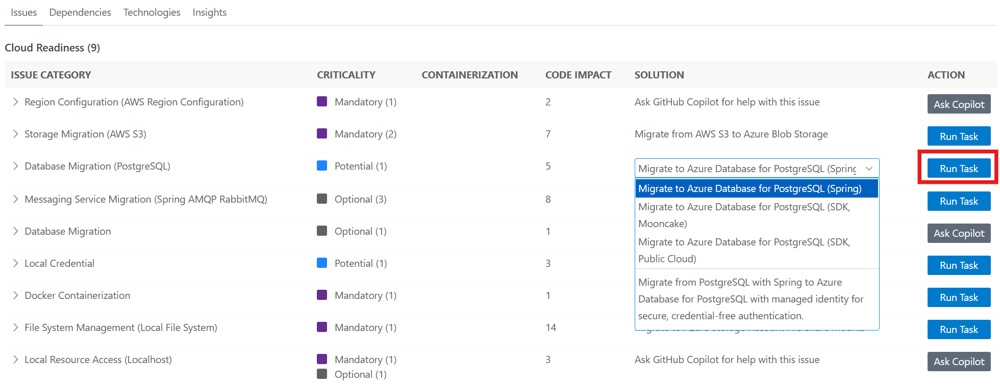
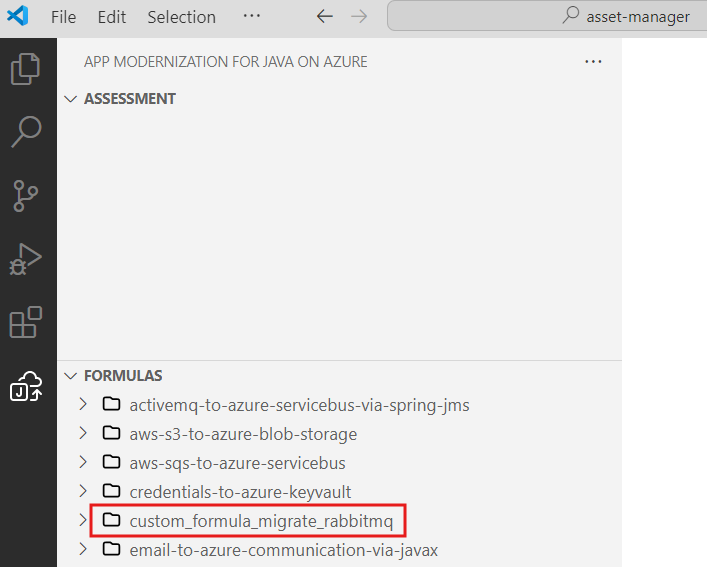

# Workshop: migrate this project to Azure

> [!IMPORTANT]
> `GitHub Copilot App Modernization - Java on Azure` is in preview and is subject to change before becoming generally available.

`GitHub Copilot App Modernization - Java on Azure` (also referred to as GitHub Copilot App Modernization - Java on Azure) assists with app assessment, planning and code remediation. It automates repetitive tasks, boosting developer confidence and speeding up the Azure migration and ongoing optimization.

In this workshop, you learn how to use `GitHub Copilot App Modernization - Java on Azure` to assess and migrate a sample Java application `asset-manager` to Azure. For more information about the sample application, see [Asset Manager](README.md).

## Prerequisites

To successfully complete this workshop, you need the following:

- [VSCode](https://code.visualstudio.com/): The latest version is recommended.
- [A Github account with Github Copilot enabled](https://github.com/features/copilot): All plans are supported, including the Free plan.
- [GitHub Copilot extension in VSCode](https://code.visualstudio.com/docs/copilot/overview): The latest version is recommended.
- [AppCAT](https://aka.ms/appcat-install): Required for the app assessment feature.
- [JDK 21](https://learn.microsoft.com/en-us/java/openjdk/download#openjdk-21): Required for the code remediation feature and running the initial application locally.
- [Maven 3.9.9](https://maven.apache.org/install.html): Required for the assessment and code remediation feature.
- [Azure subscription](https://azure.microsoft.com/free/): Required to deploy the migrated application to Azure.
- [Azure CLI](https://docs.microsoft.com/cli/azure/install-azure-cli): Required if you deploy the migrated application to Azure locally. The latest version is recommended.
- Fork the [GitHub repository](https://github.com/Azure-Samples/java-migration-copilot-samples) that contains the sample Java application. Clone it to your local machine. Open the `asset-manager` folder in VSCode and checkout the `workshop` branch.

## Install GitHub Copilot App Modernization - Java on Azure Tool

In VSCode, open the Extensions view from Activity Bar, search `GitHub Copilot App Modernization - Java on Azure` extension in marketplace. Select the Install button on the extension. After installation completes, you should see a notification in the bottom-right corner of VSCode confirming success.

In VSCode, configure runtime arguments to enable the proposed API:
```json
  "enable-proposed-api": ["Microsoft.migrate-java-to-azure"],
```
1. Press **Ctrl+Shift+P** and select **Preferences: Configure Runtime Arguments**.
2. Add the above JSON snippet into the editor and save.
3. Restart VSCode.


## Migrate the Sample Java Application

The following sections guide you through the process of migrating the sample Java application `asset-manager` to Azure using GitHub Copilot App Modernization - Java on Azure.

### Assess Your Java Application

The first step is to assess the sample Java application `asset-manager`. The assessment provides insights into the application's readiness for migration to Azure.

1. Open the VS code with all the prerequisites installed on the asset manager by changing the directory to the `asset manager` directory and running `code .` in that directory.
1. Open the extension `GitHub Copilot App Modernization - Java on Azure`.
1. The **Assess** button looks a triangle pointing right. Select **Assess**, the Github Copilot chat window will be opened and propose to run Modernization Assessor. Please confirm the tool usage by clicking **Continue**. 


   > **NOTE**: If you are asked to allow the tool access the language models provided by GitHub Copilot Chat, select **Allow** to proceed.

1. After each step, please manually input "continue" to confirm and proceed.
1. Wait for the assessment to be completed and the report to be generated.
1. Review the **Summary** report. Select **Propose Solution** to view the proposed solutions for the issues identified in the summary report.
1. For this workshop, deselect all solutions and select **Use Azure Database for PostgreSQL** in the Solution report, then select **Confirm Solution**.

1. In the Migrate report, click **Migrate**.

### Migrate to Azure Database for PostgreSQL Flexible Server using Predefined Formula

1. After clicking the Migrate button in the Solution Report, Copilot chat window will be opened with Agent Mode.
1. In Copilot chat window, click **Continue** repeatedly to confirm each tool action. The Copilot Agent uses various tools to facilitate application modernization. Each tool's usage requires confirmation by clicking the `Continue` button.
1. After each step, please manually input "Continue" to confirm and proceed.
1. Click **Continue** to confirm to run **Java Application Build-Fix** tool. This tool will attempt to resolve any build errors, in up to 10 iterations.
1. After the Build-Fix tool begins, click **Continue** to proceed and show progress and migration summary.
1. Review the proposed code changes and click **Keep** to apply them.

### Migrate to Azure Blob Storage and Azure Service Bus using Custom Formula

Recall that the sample Java application `asset-manager` uses AWS S3 for image storage and Spring AMQP RabbitMQ for message queuing. The `workshop` branch has additional commits that have already migrated the code for **Web Application** with custom code remediation to use Azure Blob Storage and Azure Service Bus, respectively. 

Now, you migrate the **Worker Service** to use Azure Blob Storage and Azure Service Bus as well, by using custom formulas created from existing commits that migrated the **Web Application**.

1. Open the sidebar of `GitHub Copilot App Modernization - Java on Azure`. Hover the mouse over the **Formulas** section.  Select **Create formula from source control**. This icon looks like two circles with arrows pointing to the other circle. 

1. Type **migrate web** to search for the commits that migrated the **Web Application**, and you should see two commits listed:
   * migrate web rabbitmq to azure service bus
   * migrate web s3 to azure blob storage

1. You will create two custom formulas based on the two commits. First, create the formula for migrating rabbitmq. Select the commit of **migrate web rabbitmq to azure service bus**, click OK.
1. Click **Create New** to create a new custom formula.
1. Default formula name will be generated. Give it a new name: "custom formula migrate rabbitmq". Press `Enter` to confirm. Then, formula description, and search patterns will be generated in order. Press `Enter` repeatedly to confirm.
1. Now, the custom formula for migrating rabbitmq is generated and shows in the section of formulas in of `GitHub Copilot App Modernization - Java on Azure` blade.

1. Create another custom formula for migrating S3. Follow the same steps you just did, select the commit **migrate web s3 to azure blob storage** to create a new custom formula with name: "custom formula migrate s3".
1. Now, the two custom formulas are ready.

1. Select and run the two custom formulas one by one you created in the formulas section of `GitHub Copilot App Modernization - Java on Azure`, one at a time.


1. Follow the same steps as the predefined formula to review and apply the changes, and run the Java Application Build-Fix tool to apply build fixes.
1. Review the proposed code changes and click **Keep** to apply them.

## Deploy to Azure

At this point, you have successfully migrated the sample Java application `asset-manager` to use Azure Database for PostgreSQL, Azure Blob Storage, and Azure Service Bus. 

To deploy your app to Azure, you can use the Azure GitHub Copilot to automatically generate IOC files for quick deployment. 
See https://learn.microsoft.com/en-us/azure/developer/github-copilot-azure/quickstart-deploy-existing-app for more details.