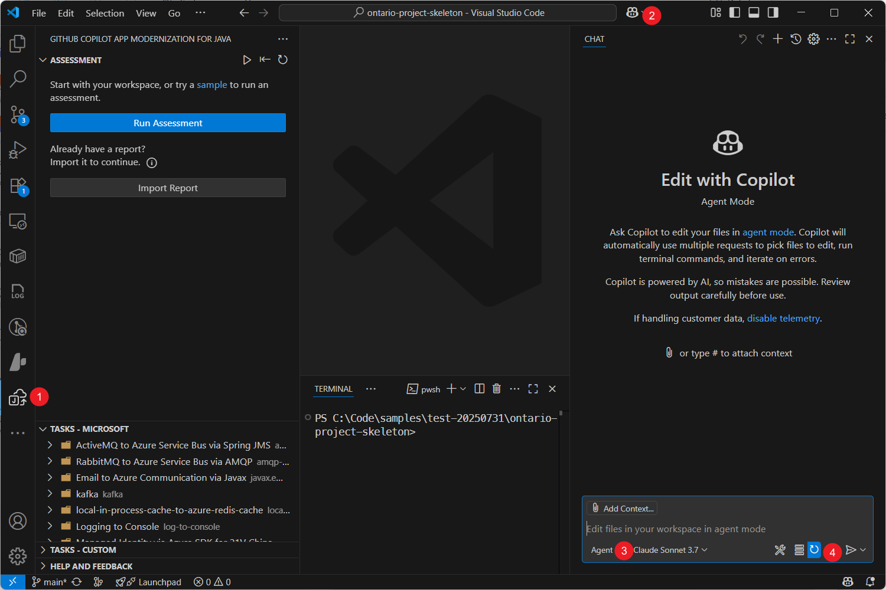

# Migrate a legacy Java EE Ant project to a Jakarta EE 10 Maven project

This workshop guides you through migrating a legacy Java EE Ant project to a Jakarta EE 10 Maven project. After completing the workshop, the project will be fully migrated from Java EE to Jakarta EE 10, upgraded from Spring Framework 5.3.39 to 6.2.x, and ready to build with Maven.

## About this Sample Project

A Java EE web application running on Open Liberty with a hybrid architecture that supports both traditional servlets and Spring MVC. The application manages student profiles with CRUD operations and demonstrates migrating from Ant to Maven and Java EE to Jakarta EE. 

For the project architecture, see [project details](doc/architecture.md).
For how to start this project, see [getting started](doc/getting-started.md)

## Prerequisites

- **Java 17** or higher
- **Apache Ant**, tested version: `1.10.14`.
- **Maven**, tested version: `3.8.7`.
- **Docker & Docker Compose** (Optional, for running the sample application)
- [Visual Studio Code](https://code.visualstudio.com/download)
- [VS Code Extension: GitHub Copilot App Modernization](https://marketplace.visualstudio.com/items?itemName=vscjava.migrate-java-to-azure)
  - This extension depends on [VS Code Extension: GitHub Copilot App Modernization – Upgrade for Java](https://marketplace.visualstudio.com/items?itemName=vscjava.vscode-java-upgrade). Both extensions will be installed automatically when you install **GitHub Copilot App Modernization**.

## Assess the Project

Please follow the steps below to assess and detect the Eclipse/Ant project:

1. Open [student-web-app](jakarta-ee/student-web-app) in VSCode.

1. Click **GitHub Copilot app modernization for Java** from the left side tool bar.

    Click the `Toggle Chat` icon on the top, select `Agent` mode. If the **blue reload button** appears at the bottom, click it to reload the tools registration. This is only required the first time you install the extensions.

    

1. Click **Run Assessment** button from the **Assessment** section on the left side view. It will open GitHub Copilot Chat window at the right side, and start to assess the project with the predefined prompt. 

1. Interact with Copilot in the chat window and select **Continue** to proceed whenever you're ok with the actions suggested by the Copilot.

1. After the assessment is done, an **Assessment Report** will be generated and opened in the editor. From the bottom of the report, you can see **Build Tool (Ant)** in sectioin **Java Modernization**, and associated action **Migrate** to migrate the project to Maven project.

    

## Convert Ant project to Maven project

Now you can convert the Ant project to Maven project.

1. Select Action **Migrate** associated with **Build Tool (Ant)**, and start the migration with the predefined prompt. Recommend to use LLM model **Claude Sonnet 3.7** for the migration.

    

1. Interact with Copilot in the chat window and select **Continue** to proceed whenever you're ok with the actions suggested by the Copilot.

    If you see the request from Copilot to ask you confirm the migration plan, please review and manually confirm the migration plan before proceeding. For example, input `Confirm` in the chat box and click `Send`.

1. After the migration is complete, select **Keep** for changed files.

## Assess and detect the legacy Java EE and Spring Framework project

Please follow the similar steps before to assess and detect the legacy Java EE and Spring Framework project:

1. Select **GitHub Copilot app modernization for Java** from the left side tool bar.
1. Select **Run Assessment** from the **Assessment** section. It will open GitHub Copilot Chat window at the right side, and start to assess the project with the predefined prompt. 
1. Interact with Copilot in the chat window and select **Continue** to proceed whenever you're ok with the actions suggested by the Copilot.
1. After the assessment is done, an **Assessment Report** will be generated and opened in the editor. From the bottom of the report, you can see **Framework Upgrade (Java EE/Jakarta EE)** and **Framework Upgrade (Spring Framework)** in sectioin **Java Modernization**, and associated action **Upgrade** to upgrade the project.

Before you proceed with the next step, manually clean up the assistant files of the assessment tool. They will be automatically cleaned up in the future releases of the tool.

1. Replace `appcat` with `*` in the `.github\appmod-java\.gitignore` file to ignore all files within the `.github\appmod-java` directory.
1. Open **Source Control** view in VSCode, and select **Discard All Changes** to discard all changes made by the assessment tool.

## Upgrade the Project to Jakarta EE 10 and Spring Framework 6.x

Now you can upgrade the project. In this workshop, you select to upgrade Spring Framework version as it will also upgrade dependent Java EE version.

1. Select Action **Upgrade** associated with **Upgrade Spring Framework Version**, and start the upgrade with the predefined prompt. Recommend to use LLM model **Claude Sonnet 3.7** for the migration.
1. Interact with Copilot in the chat window and select **Continue** to proceed whenever you're ok with the actions suggested by the Copilot.
1. After the migration is complete, select **Keep** if there are any changed files.

There is an Upgrade Summary generated, review and do any follow-up actions based on your needs.

